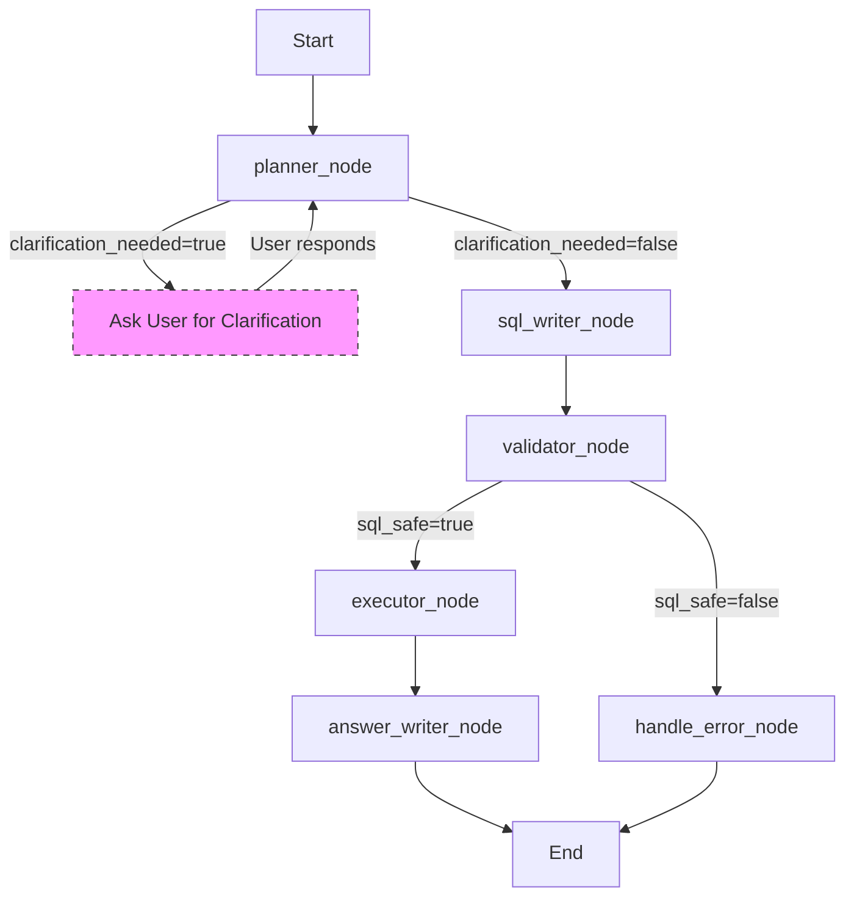

# Agent

## Agent Architecture Pattern
**Chosen:** Graph (LangGraph) — The agent requires a multi-step pipeline with conditional edges for validation, retries, and error handling. A simple linear chain would not allow for re-planning when the validator rejects SQL or when the executor returns an error. The graph pattern gives us the needed control flow while keeping the implementation clear.

## LLM Provider & Model
| Agent / Node | Provider | Model ID | Rationale |
|--------------|----------|----------|-----------|
| Planner | OpenRouter | anthropic/claude-sonnet-3.5 | Strong reasoning for question refinement and ambiguity detection. |
| SQL Writer | OpenRouter | anthropic/claude-sonnet-3.5 | High-quality SQL generation; Sonnet 3.5 is strong at structured output. |
| Validator | OpenRouter | anthropic/claude-3-haiku | Fast, cheap check for SQL safety; does not need heavy reasoning. |
| Executor | OpenRouter | anthropic/claude-3-haiku | Not an LLM node; this node executes SQL. (Kept for completeness; actually a tool call.) |
| Answer Writer | OpenRouter | anthropic/claude-sonnet-3.5 | Good at natural-language summarization and optional chart suggestion. |

**Fallback behaviour:** On 429/5xx, retry with exponential backoff (max 2 retries). On 401/403, surface an actionable error to check the API key. The agent does not degrade to a stub; it returns an error to the user.

**Prompt strategy:** System/user split with structured output (JSON mode) for Planner, SQL Writer, and Validator. Answer Writer uses plain text with optional markdown for chart specifications.

## Tools & Tool Calling
| Tool name | Description | Inputs | Output | Side-effects |
|-----------|-------------|--------|--------|--------------|
| `introspect_schema` | Returns the database schema (tables and columns only) for the agent to use in SQL generation. | None | JSON: `{ tables: { name: string, columns: [{name: string, type: string}][] } }` | Read-only query to the database's information schema. |
| `execute_sql` | Runs a parameterized SQL query against the MSSQL database and returns the result set. | SQL string, parameters (optional) | `{ rows: any[], row_count: int, column_names: string[] }` | Read-only database query. Commits nothing; uses a read-only transaction. |
| `log_audit` | Writes an immutable audit record for the agent run. | `run_id`, `officer_id`, `question`, `refined_question`, `sql`, `row_count`, `latency_ms`, `result_hash` | None | Inserts into the audit table. |

**Tool selection strategy:** The LLM (Planner, SQL Writer, Validator) decides which tool to call based on the current state and the node's purpose. The graph wiring forces the sequence: Planner may call `introspect_schema`; SQL Writer calls `introspect_schema` to ground the SQL; Validator does not call tools (it validates the SQL string); Executor calls `execute_sql`; Answer Writer does not call tools.

**Tool failure handling:** 
- `introspect_schema`: On failure, set `state.error` and route to `handle_error`.
- `execute_sql`: On SQL error (e.g., syntax, permission), capture the error message in `state.error` and route to `handle_error`. On transient errors (timeout, deadlock), retry up to 2 times with backoff before setting error.
- `log_audit`: On failure, log the error but do not fail the run (audit is important but not critical to the answer).

## Agent State
```python
class AgentState(TypedDict):
    # Identity
    run_id: int                          # set at initialisation
    officer_id: str | None               # from header or login (Phase 3)
    # Input
    question: str                        # raw user question
    refined_question: str | None         # after Planner (if clarification not needed)
    clarification_needed: bool           # True if Planner could not confidently refine
    clarification_question: str | None   # what to ask the user
    # Pipeline data (populated progressively by nodes)
    sql: str | None                      # generated SQL
    sql_safe: bool                       # after Validator
    execution_result: dict | None        # from Executor: rows, count, etc.
    # Output
    answer: str | None                   # natural-language answer
    chart_spec: dict | None              # optional Vega-Lite or similar spec
    # Control
    error: str | None                    # set by any node on fatal failure
```

## Nodes / Steps
### `planner_node`
**Reads from state:** `question`  
**Writes to state:** `refined_question`, `clarification_needed`, `clarification_question`  
**LLM call:** Yes; prompt: "Given the user's question about police data, determine if it is clear enough to generate SQL. If ambiguous or missing key details (like time frame, location, or specific data type), produce a clarification question. Otherwise, produce a refined question that removes ambiguity and is ready for SQL generation. Output JSON with keys: `refined_question` (string), `clarification_needed` (boolean), `clarification_question` (string or null)."  
**External calls:** May call `introspect_schema` to ground the refinement in available tables/columns.  
**Behaviour:** The Planner decides whether the user's question is answerable as-is or needs clarification. It outputs a refined question if confident, or a clarification question to ask the user. This prevents the SQL Writer from guessing and producing unsafe or incorrect SQL.

### `sql_writer_node`
**Reads from state:** `refined_question` (if `clarification_needed` is False)  
**Writes to state:** `sql`  
**LLM call:** Yes; prompt: "You are a SQL expert for a Microsoft SQL Server database with tables for FIR/CCTNS, HR/personnel, and logistics/property. Given the following schema: {schema} and the user's question: {refined_question}, generate a single, safe, read-only SQL query that answers the question. The query must use parameterized placeholders for any user-specific values (like officer_id) and must include a LIMIT or TOP clause to prevent large result sets. Output ONLY the SQL query in a code block marked as sql."  
**External calls:** Calls `introspect_schema` to get the schema (tables and columns only).  
**Behaviour:** The SQL Writer generates a parameterized SQL query using the provided schema. It is instructed to avoid `SELECT *`, to use explicit column lists, and to add a `LIMIT` or `TOP` clause (configurable, default 1000). The query is designed to be run by a read-only database user.

### `validator_node`
**Reads from state:** `sql`  
**Writes to state:** `sql_safe`  
**LLM call:** Yes; prompt: "You are a SQL safety expert. Review the following SQL query for a read-only reporting tool. Determine if it is safe to execute. It must: 1) be a SELECT statement (no INSERT/UPDATE/DELETE/DROP/etc.), 2) not use `SELECT *`, 3) include a LIMIT or TOP clause, 4) only reference tables and columns from the provided schema, and 5) not contain any user-submitted strings directly in the SQL (must use parameters). Output JSON with a single key `sql_safe` (boolean)."  
**External calls:** None (validates the SQL string directly).  
**Behaviour:** The Validator checks the generated SQL for safety compliance. If it passes, `sql_safe` is set to True; if not, it is False and the error is captured in `state.error` (via an edge) to route to the handler.

### `executor_node`
**Reads from state:** `sql` (only if `sql_safe` is True)  
**Writes to state:** `execution_result`  
**LLM call:** No; this is a tool call node.  
**External calls:** Calls `execute_sql` with the SQL query.  
**Behaviour:** Executes the SQL against the MSSQL database using SQLAlchemy with a read-only connection. Returns the result set, row count, and column names. On success, populates `execution_result`. On failure (SQL error, timeout, etc.), sets `state.error` with the error message.

### `answer_writer_node`
**Reads from state:** `question`, `refined_question`, `execution_result`  
**Writes to state:** `answer`, `chart_spec`  
**LLM call:** Yes; prompt: "You are a helpful police data analyst. Given the original question: {original_question}, the refined question: {refined_question}, and the query results: {result_summary} (including row count and a sample of the data), produce a natural-language answer that directly addresses the user's question. If the result is suitable for a visualization (e.g., time series, categorical counts, geographic data), suggest a chart type and provide a Vega-Lite specification. Output JSON with keys: `answer` (string) and `chart_spec` (object or null)."  
**External calls:** None (uses the execution result from state).  
**Behaviour:** The Answer Writer crafts a final answer in plain language, optionally suggesting a visualization. It does not see the raw rows (only a summary and sample to avoid leaking data), but can suggest charts based on the shape of the data (e.g., if there's a date column and a numeric column, suggest a line chart).

### `handle_error_node`
**Reads from state:** `error`  
**Writes to state:** None (terminal node)  
**LLM call:** No  
**External calls:** May call `log_audit` to record the failed run.  
**Behaviour:** Sets the final answer to an user-friendly error message (e.g., "I encountered an error while processing your request: {error}. Please try rephrasing your question.") and logs the audit entry with the error.

## Graph / Flow Topology


**Conditional edges:**
- From `planner_node`: if `state.clarification_needed` is True, go to clarification step (which is outside the graph; the API will return a clarification request to the user and wait for a new input that resets the graph with the new question).
- From `validator_node`: if `state.sql_safe` is True, proceed to `executor_node`; else, go to `handle_error_node`.
- All other edges are sequential.

## Memory & Context
| Scope | Mechanism | What is stored |
|-------|-----------|----------------|
| **Within a run** | LangGraph state | All in-progress data (question, refined question, SQL, execution result, etc.) |
| **Across runs** | Database table (`officer_reports`) | Pinned reports (saved queries) and their results (optional cache) for the officer. |
| **Conversation** | None (stateless by design; each question is independent) | Not applicable; the agent does not maintain chat history across turns in Phase 1. (Phase 2 may add sidebar recency.) |

**Context window management:** The agent uses schema-only context (tables and columns) for the LLM, which is typically under 2k tokens. No conversation history is included in the prompt, keeping the context window lean.

## Human-in-the-Loop Checkpoints
| Checkpoint | What is shown to the user | Expected user action | Timeout / default |
|------------|---------------------------|----------------------|-------------------|
| **Clarification** | A plain-language question asking for missing details (e.g., "To answer that, I need to know: which district are you interested in?") | Provide the missing information or rephrase the question. | 2 minutes; after timeout, the agent proceeds with the original question and may produce a best-effort answer or error. |

## Error Handling & Recovery
**Node-level:** Each node catches its own exceptions; fatal errors set `state["error"]` and route to `handle_error_node` via the graph's error edges (implicit in the conditional edges above; any node can set error and the next conditional edge will route to handler based on error presence).

**Graph-level (handle_error node):**
- Reads: `state.error`, `state.run_id`
- Updates DB: audit table record status → "failed", `error_message`, `completed_at`
- Logs error with `run_id` context
- Terminates graph (returns an error answer to the user)

**Resume / retry strategy:** The agent does not support resuming a failed run from a checkpoint; each question is a new run. Retries are handled at the tool level (e.g., `execute_sql` retries on transient DB errors).

**Partial failure:** If a non-critical step fails (e.g., suggesting a chart spec fails), the agent logs the error but continues to provide the answer. The chart spec is optional.

## Observability
| Signal | What | Where |
|--------|------|-------|
| **Trace** | One trace per run, one span per node | stdout via structlog (JSON format) |
| **LLM calls** | Prompt tokens, completion tokens, latency, model | Structured log (includes `llm_call` event) |
| **Tool calls** | Tool name, inputs, success/error, latency | Structured log (includes `tool_call` event) |
| **Run outcome** | Status, total duration, error if any | Database audit table + structured log |

## Concurrency Model
- **Run isolation:** Each API call (`/api/ask`) creates a new `run_id` and runs the agent graph in isolation. Concurrent runs are allowed; they are distinguished by `run_id`.
- **Parallel nodes within a run:** The current graph is linear; no nodes run in parallel. (Future phases could parallelize schema introspection and LLM calls if needed.)
- **Checkpointing:** None required for Phase 1 (stateless runs). If we add conversation history in Phase 2, we may add a checkpointer.

## Graph Assembly (`src/graph/agent.py`)
```python
from langgraph.graph import StateGraph, END
from .state import AgentState
from .nodes import (
    planner_node,
    sql_writer_node,
    validator_node,
    executor_node,
    answer_writer_node,
    handle_error_node,
)

def build_graph():
    graph = StateGraph(AgentState)

    # Add nodes
    graph.add_node("planner", planner_node)
    graph.add_node("sql_writer", sql_writer_node)
    graph.add_node("validator", validator_node)
    graph.add_node("executor", executor_node)
    graph.add_node("answer_writer", answer_writer_node)
    graph.add_node("handle_error", handle_error_node)

    # Set entry point
    graph.set_entry_point("planner")

    # Add edges
    graph.add_conditional_edges(
        "planner",
        lambda state: "ask_user" if state.get("clarification_needed") else "sql_writer",
        {
            "ask_user": "ask_user",  # This is handled outside the graph by the API
            "sql_writer": "sql_writer",
        },
    )
    graph.add_edge("sql_writer", "validator")
    graph.add_conditional_edges(
        "validator",
        lambda state: "executor" if state.get("sql_safe") else "handle_error",
        {
            "executor": "executor",
            "handle_error": "handle_error",
        },
    )
    graph.add_edge("executor", "answer_writer")
    graph.add_edge("answer_writer", END)
    graph.add_edge("handle_error", END)

    return graph.compile()

# The actual graph instance used by the runner
agent_graph = build_graph()
```

Note: The `ask_user` step is not a node in the graph; the API layer handles it by returning a clarification request to the user and waiting for a new POST that restarts the graph with the updated question.